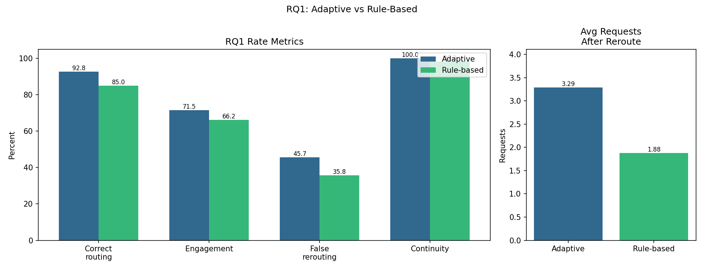
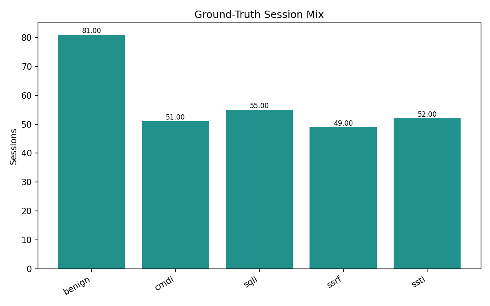
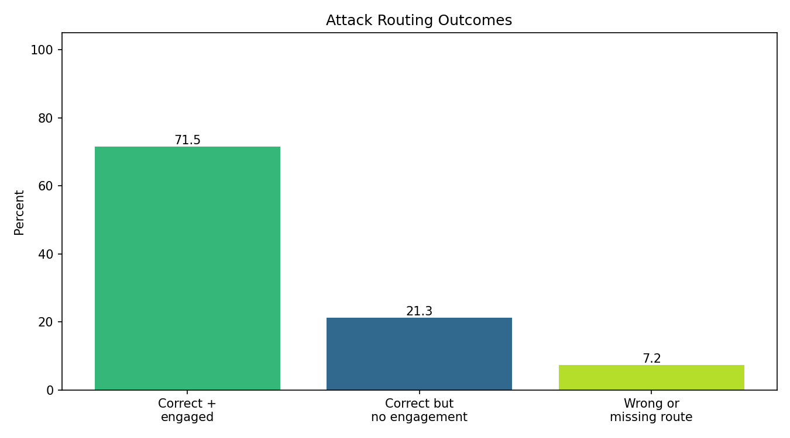
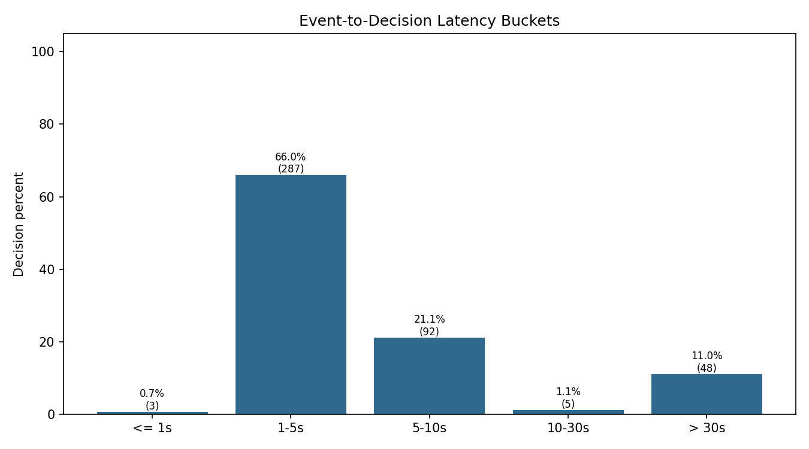

# Báo cáo metric Adaptive Honeypot

## Phạm vi báo cáo

Báo cáo này đánh giá flow adaptive routing trên traffic Web hỗn hợp: benign, benign near-miss, baseline attack và obfuscated attack.

- Generated at: `2026-06-23T05:50:48.468041+00:00`
- Session prefix: `all sessions`
- Metric source: `session_id_ground_truth`
- Traffic manifest: `adaptive_honeypot_system/control_plane/replay_buffer/data/obf_20260602_combined_traffic_manifest.json`

Nguồn runtime log dùng để thống kê:

```text
logs/real_backend/service_requests.jsonl
logs/honeypots/cmdi/service_requests.jsonl
logs/honeypots/sqli/service_requests.jsonl
logs/honeypots/ssrf/service_requests.jsonl
logs/honeypots/ssti/service_requests.jsonl
logs/llm_analyzer/llm_fields.jsonl
```

## Liên hệ Research Questions

| Research Question | Metric trong báo cáo | Ghi chú |
| --- | --- | --- |
| RQ1: LLM + RL có tốt hơn rule-based không? | Mục RQ1 trong báo cáo này | Đọc bảng so sánh adaptive với baseline rule-based trên cùng traffic manifest. |
| RQ2: RL action có route đúng honeypot không? | Correct honeypot routing rate, attack routing outcomes | Tách rõ route decision đúng và outcome sau route. |
| RQ3: Độ trễ pipeline thế nào? | Event-to-decision latency buckets | Đo thời gian từ log event đến khi có decision. |
| RQ4: Rerouting có tăng engagement và giữ service ổn định không? | Engagement, avg requests sau reroute, session length, false rerouting, continuity | Đo engagement, route nhầm benign và continuity. |

## Quy mô dữ liệu

| Chỉ số | Giá trị |
| --- | --- |
| Tổng session | 288 |
| Attack sessions | 207 |
| Benign sessions | 81 |
| Runtime events | 4059 |
| Service events | 1678 |
| Decision events | 435 |
| Obfuscated attack payload requests | 633 |
| Benign near-miss requests | 164 |

Tập dữ liệu phù hợp để báo cáo demo Web hiện tại vì có benign traffic, benign near-miss và bốn nhóm attack chính. Đây chưa phải benchmark production.

## Metric chính

| Metric | Ý nghĩa | Giá trị |
| --- | --- | --- |
| Honeypot engagement rate | Attack session có request thực tế vào honeypot sau reroute. | 71.498% |
| Avg requests after adaptive rerouting | Số request trung bình phát sinh sau khi adaptive route được áp dụng. | 3.288 |
| Session length | Thời lượng session từ request đầu đến request cuối. | min 0.157s, median 4.488s, avg 4.071s, max 30.622s |
| Correct honeypot routing rate | Attack session được route đúng honeypot theo đúng loại attack. | 92.754% |
| False rerouting rate on benign sessions | Benign session bị route nhầm vào honeypot. Càng thấp càng tốt. | 45.679% |
| Normal-service continuity rate | Request không thuộc API mục tiêu vẫn đi về real service sau reroute. | 100.000% |

Nhận định ngắn:

- Correct honeypot routing rate đạt `92.754%` theo nghĩa route decision đúng loại honeypot.
- Honeypot engagement rate đạt `71.498%` theo nghĩa attack session có follow-up thực tế vào honeypot sau reroute.
- Route đúng và có engagement vào đúng honeypot kỳ vọng đạt `71.498%`.
- Normal-service continuity đạt `100.000%`, tức rerouting theo API mục tiêu không làm hỏng các API còn lại trong cùng session.
- False rerouting trên benign là `45.679%`; đây là điểm cần cải thiện nếu mở rộng đề tài.

## RQ1: Adaptive vs Rule-Based

| metric | adaptive_percent | rule_based_percent | adaptive_value | rule_based_value | better_system |
| --- | --- | --- | --- | --- | --- |
| Correct honeypot routing rate | 92.754 | 85.024 | 0.927536 | 0.850242 | adaptive |
| Honeypot engagement rate | 71.498 | 66.184 | 0.714976 | 0.661836 | adaptive |
| Avg requests after adaptive rerouting |  |  | 3.28821 | 1.879581 | adaptive |
| False rerouting rate on benign sessions | 45.679 | 35.802 | 0.45679 | 0.358025 | rule_based |
| Normal-service continuity rate | 100.0 | 98.264 | 1.0 | 0.982639 | adaptive |

Nhận xét ngắn cho RQ1:

- Adaptive đạt `92.754%` correct routing, cao hơn rule-based `85.024%`.
- Adaptive đạt `71.498%` engagement, cao hơn rule-based `66.184%`.
- Avg requests after reroute: adaptive `3.288` vs rule-based `1.88`.
- Rule-based bảo thủ hơn trên benign của tập benchmark này: false rerouting `35.802%` so với adaptive `45.679%`.



Hình này gom phần so sánh chính của RQ1: các metric dạng tỷ lệ ở bên trái và số request trung bình sau reroute ở bên phải.

## Routing outcome gắn với RQ2/RQ4

| group | outcome | sessions | percent | research_question |
| --- | --- | --- | --- | --- |
| Attack | Route đúng và có engagement | 148 | 71.498 | RQ2/RQ4 |
| Attack | Route đúng nhưng chưa có engagement | 44 | 21.256 | RQ4 |
| Attack | Không route đúng hoặc không route | 15 | 7.246 | RQ2 |
| Benign | Giữ ở normal service | 44 | 54.321 | RQ4 |
| Benign | Bị route nhầm vào honeypot | 37 | 45.679 | RQ4 |

Bảng này thay cho bảng chi tiết theo từng loại attack. Ở đây `Route đúng` nghĩa là decision đã chọn đúng honeypot theo loại attack; cột `có engagement` là bước kiểm chứng tiếp theo, tức sau khi route đúng thì attacker còn thực sự follow-up vào đúng honeypot đó.

## Decision latency

| metric | count | min_ms | avg_ms | max_ms | under_1s_percent | under_5s_percent | under_10s_percent | over_30s_percent |
| --- | --- | --- | --- | --- | --- | --- | --- | --- |
| analysis_duration_ms | 435 | 161.79 | 1233.791 | 10406.58 | 86.897 | 88.506 | 99.77 | 0.0 |
| controller_roundtrip_ms | 268 | 33.34 | 45.6 | 68.42 | 100.0 | 100.0 | 100.0 | 0.0 |
| event_to_decision_latency_ms | 435 | 619.39 | 11916.596 | 101420.6 | 0.69 | 66.667 | 87.816 | 11.034 |

Ý nghĩa các trường latency:

- `analysis_duration_ms`: thời gian LLM analyzer parse log và tạo semantic fields.
- `controller_roundtrip_ms`: thời gian gọi Routing Controller/RL và áp dụng route.
- `event_to_decision_latency_ms`: tổng thời gian từ request/log đầu vào đến khi có decision. Đây là chỉ số sát RQ3 nhất.

Phần bucket latency:

| bucket | decisions | percent |
| --- | --- | --- |
| <= 1s | 3 | 0.69 |
| 1-5s | 287 | 65.977 |
| 5-10s | 92 | 21.149 |
| 10-30s | 5 | 1.149 |
| > 30s | 48 | 11.034 |

## Phân bổ session length

| bucket | sessions | percent |
| --- | --- | --- |
| <= 1s | 57 | 19.792 |
| 1-3s | 31 | 10.764 |
| 3-10s | 198 | 68.75 |
| 10-30s | 1 | 0.347 |
| > 30s | 1 | 0.347 |

## Hình ảnh chính

### 01_rate_metrics.png


Tổng hợp bốn metric dạng tỷ lệ. Ở đây correct routing là route decision đúng; engagement là follow-up thực tế sau reroute.

### 02_avg_requests_after_adaptive_rerouting.png


Số request trung bình sau reroute. Giá trị cao hơn cho thấy attacker tiếp tục tương tác sau khi bị đưa vào honeypot.

### 03_session_length_summary.png


Session length được tóm tắt bằng min, median, avg và max để nhìn nhanh độ dài ngắn-vừa-dài.

### 04_session_length_distribution.png


Phân bổ session theo bucket thời lượng để thấy phần lớn session tập trung ở khoảng nào.

### 05_ground_truth_session_mix.png



Phân bố ground truth của tập test: benign và bốn nhóm attack.

### 06_rq1_comparison.png


So sánh trực tiếp adaptive với rule-based cho RQ1: correct routing, engagement, false rerouting, continuity và avg requests after reroute.

### 07_routing_outcome_summary.png



Outcome tổng hợp cho RQ2/RQ4: đúng+engaged, đúng nhưng chưa engaged, sai/không route.

### 08_decision_latency_buckets.png



Độ trễ event-to-decision theo bucket để đọc trực tiếp tỷ lệ decision nhanh/chậm.

## Kết luận

- RQ1: Adaptive route đúng nhiều hơn và route sớm hơn baseline rule-based trên cùng traffic manifest; baseline bảo thủ hơn với benign nhưng bỏ sót nhiều payload evade hơn.
- RQ2: Correct routing cần đọc theo metric chính; bảng outcome phía trên cho thấy phần nào trong số đó đã tiếp tục tạo engagement thực tế.
- RQ3: Nên đọc latency bằng bucket event-to-decision; đây là metric để giải thích vì sao route đúng nhưng engagement có thể chưa xảy ra.
- RQ4: Continuity đang tốt, false rerouting trên benign là rủi ro lớn nhất.
