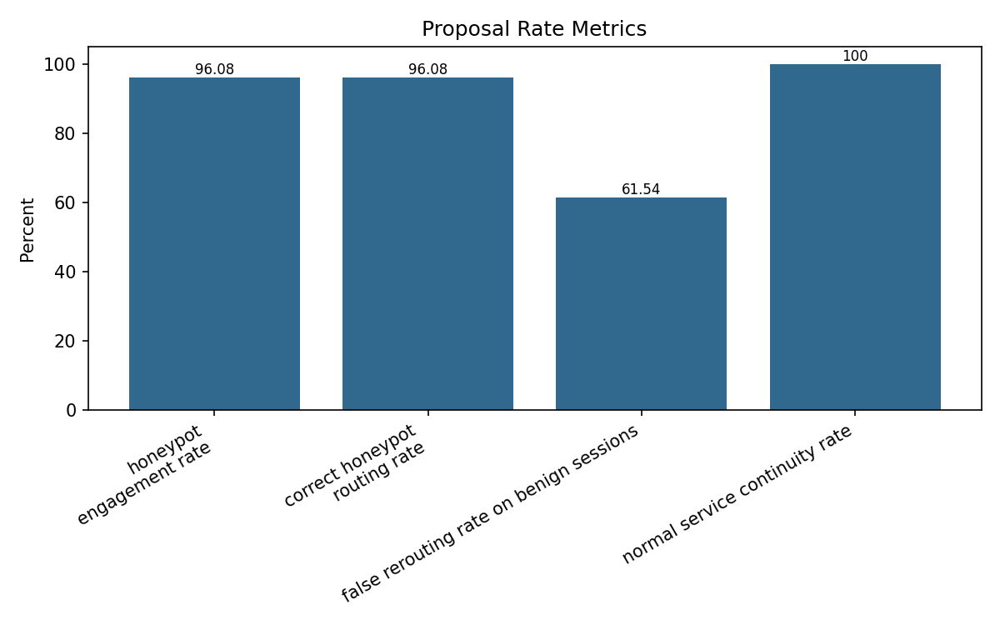
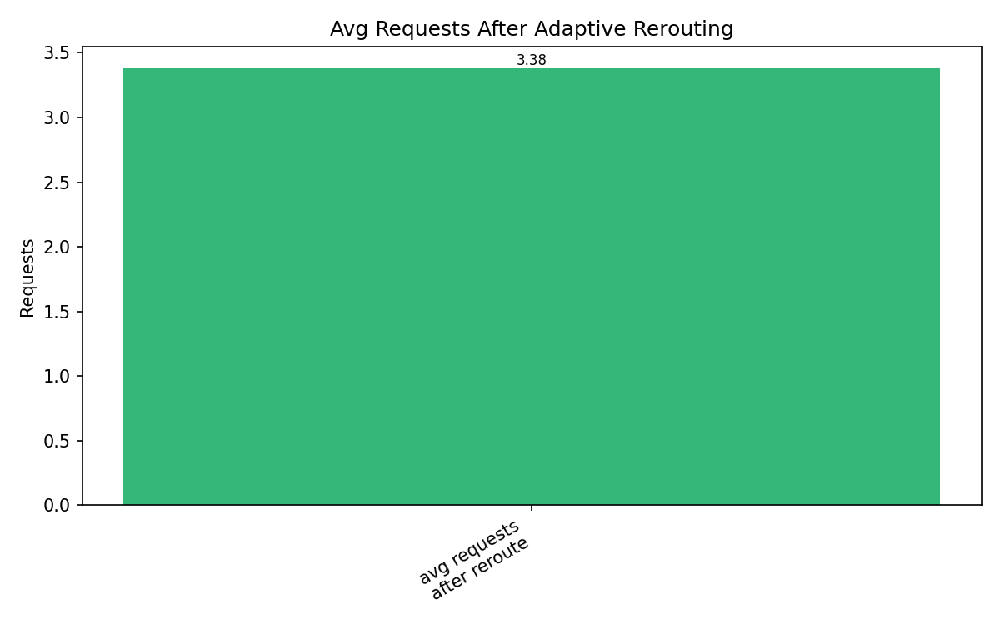
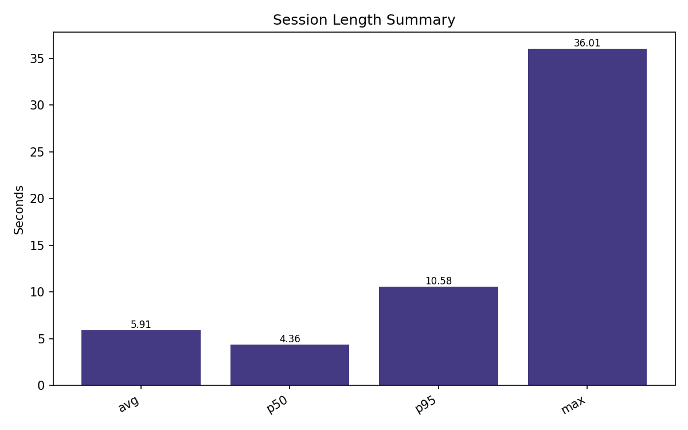
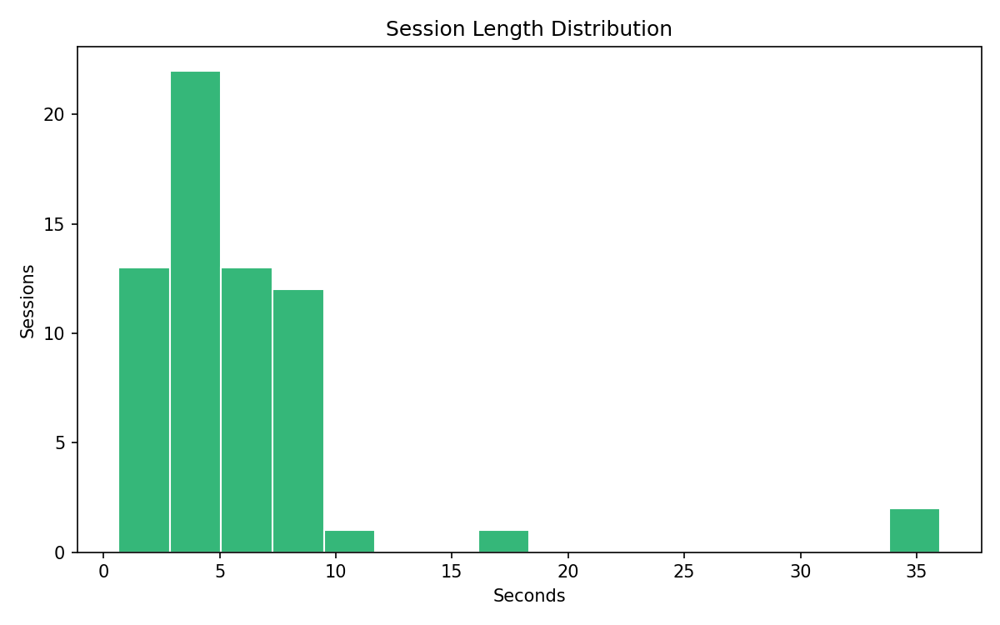

# Adaptive Honeypot Metrics Report

- Generated at: `2026-05-30T14:49:43.245310+00:00`
- Session prefix: `evasion_20260530`
- Metric source: `session_id_ground_truth`

## Proposal Rate Metrics

| Metric | Ratio | Percent |
| --- | --- | --- |
| honeypot_engagement_rate | 0.960784 | 96.078 |
| correct_honeypot_routing_rate | 0.960784 | 96.078 |
| false_rerouting_rate_on_benign_sessions | 0.615385 | 61.538 |
| normal_service_continuity_rate | 1.0 | 100.0 |

## Proposal Value Metrics

| Metric | Value |
| --- | --- |
| avg_requests_after_adaptive_rerouting | 3.37931 |
| session_length_seconds_avg | 5.908434 |
| session_length_seconds_p50 | 4.356903 |
| session_length_seconds_p95 | 10.576108 |
| session_length_seconds_max | 36.013551 |

## Evaluation Sample

| Metric | Value |
| --- | --- |
| events | 535 |
| decision_events | 118 |
| service_events | 344 |
| sessions | 64 |
| ground_truth_attack_sessions | 51 |
| ground_truth_benign_sessions | 13 |
| ground_truth_routed_sessions | 58 |
| engaged_attack_sessions | 49 |
| correctly_routed_attack_sessions | 49 |
| false_rerouted_benign_sessions | 8 |
| continuity_checked_events | 49 |
| continuity_failures | 0 |

## Coverage

```json
{
  "has_llm_decision_fields": true,
  "has_host_service_fields": true,
  "has_route_match_fields": true,
  "has_expected_backend_fields": true
}
```

## Figures









## Notes

- Metrics are computed from host-mounted debug logs.
- Generated replay sessions use the session id suffix as ground truth when available.
- `llm_fields.jsonl` contains RL state/action/backend decision fields.
- Service request logs confirm whether the selected route actually reached the intended honeypot.
